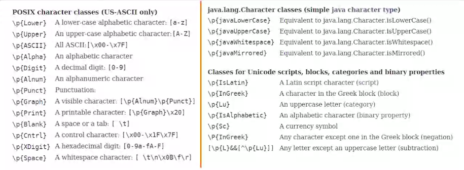

# java-regex
Java Fundamentals: The Regular Expressions Playbook by Victor Grazi on Pluralsight

## Regular Expressions
Expression | Description | Example
-----------|-------------|--------
. | All-purpose wildcard | everything (..........)
.* | Matches everything up to the end of line | aaaaabcdefghij123456 (a*.*)

## RegEx built-in character classes
In order to use this expression in Java, We must doble up the "\\"
```java
	// Any digit
	System.out.println("I'm 25 years old".replaceFirst("\\d", "3"));
``` 
Expression | Class Description|Example
-----------|------------------|-------
\d | Matches any digit | 1, 2, 5
\D | Matches anything but a digit | A, v, *space*
\w | Matches any word character | 1, a, _ 
\W | Matches anything but a word | -, () , *space*
\s | Matches any whitespace | *space*, *tab*, *new line*
\S | Matches anything but a whitespace | _, A, b
[AB\d] | Matches a custom character class | A, B, 6
[^AB\d] | Matches anything but a custom character class | C, D
[0-9] | Matches an union set | *from* 0 *to* 9
[\w&&[^1-9]] | Matches an intersection set | Any letter and only 0
(JU\|JO)AN | Matches an alternation | JUAN *or* JOAN 

## Specialized Character Classes
<p align="center"></p>

## Quantifiers
Expression | Description | Example
-----------|-------------|--------
* | Zero or more | aaaaa (a*), \d*
+ | 1 or more | \s+
? | Zero or more | \w?
{m} | Exactly m times | {2}
{m,} | At least m times | {3,}
{m,n} | At least m but not more than n times | {3,6}

## Quantifiers mode
Mode | Description | Example
-----------|-------------|--------
Greedy (default) | Match as much as possible | \d* (As many digits as possible)
? Lazy or Reluctant | Match as little as possible | \s+? (As few spaces as possible)
+ Possessive | Like greedy but no backtrack | \w*+ (As many word characters as possible, but no backtrack)